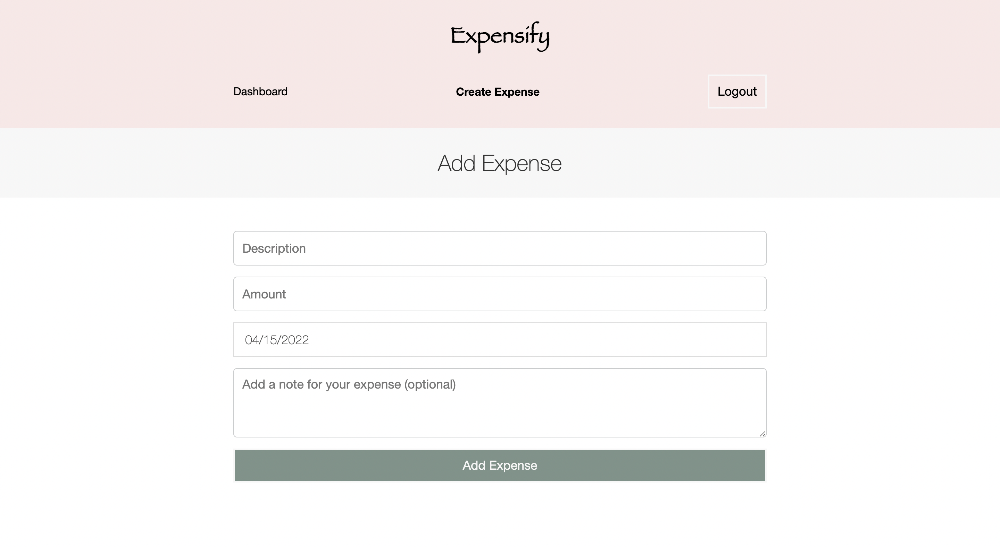
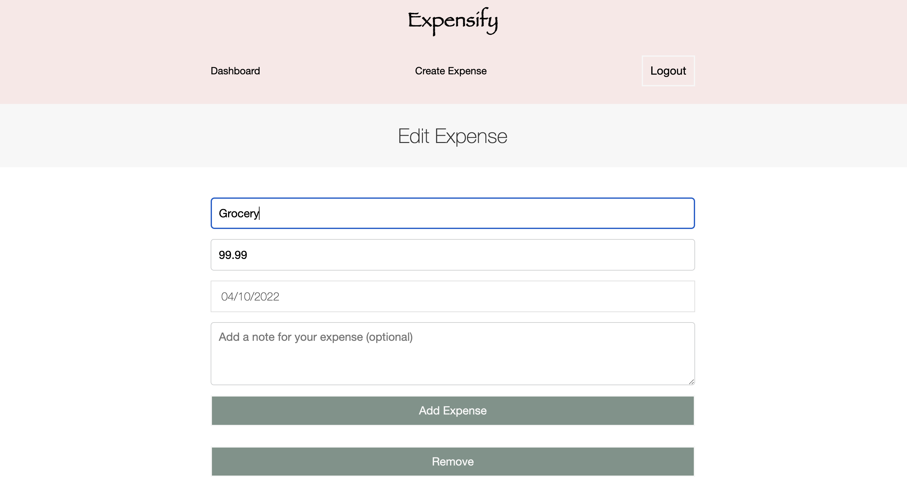
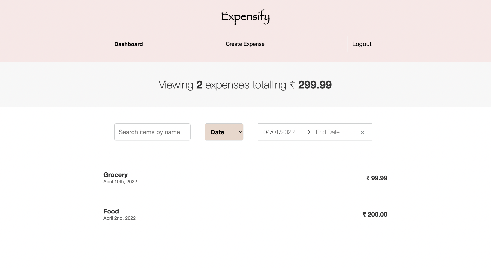

**Project from** `The Complete React Developer Course (w/ Hooks and Redux) by Andrew Mead`

## Skills covered

- React
- Redux
- Testing using JEST
- Firebase authentication and user accounts
- Javascript ES6
- Heroku
- Webpack

## Snapshots

<p align="center"></p>
<p align="center">


</p>
<p align="center"></p>

## Configuring Project on Localhost

1. `Git Clone` the repository and navigate to it's `root folder`.
   
2. Setup `firebase` by following below steps:
   ```bash
    cd src
    mkdir firebase
    cd firebase
    touch firebase.js
   ```

3. Copy paste the code snippet below:
    ```js
    import * as firebase from "firebase";

    const firebaseConfig = {
    apiKey: "",
    authDomain: "",
    databaseURL: "",
    projectId: "",
    storageBucket: "",
    messagingSenderId: "",
    appId: "",
    measurementId: "",
    };
    // Initialize Firebase
    firebase.initializeApp(firebaseConfig);

    const database = firebase.database();
    const googleAuthProvider = new firebase.auth.GoogleAuthProvider();
    export { firebase, googleAuthProvider, database as default };
    ```

4. Create a account on firebase and add project. From the project details copy paste the mentioned fields in empty strings.

## Starting the project on localhost without docker

1. Install npm packages:
    ```bash
    npm install
    ```
    
2. Build the app:
    ```bash
    npm run build:dev
    ```

3. Run the app
   ```bash
   npm run dev-server
   ```

4. Go to `localhost:8080` on web browser.

## Starting the project using docker
- Build and run the container
    ```bash
    docker-compose up --build
    ```
    
- Go to `localhost:8080` on web browser.